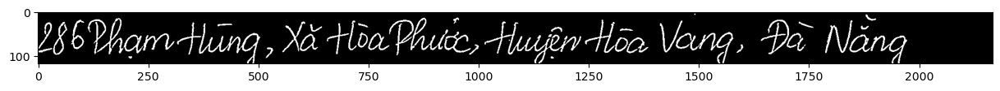

# Đề tài xây dựng ứng dụng nhận diện chữ viết tay tiếng Việt

Thực hiện: 
- Nguyễn Minh Cường 20110132
- Trần Tiến Đạt - 20110457

### Công việc cần xử lý
- Xây dựng model để dự đoán.
- Xử lý ảnh của người dùng.
- Xây dựng giao diện

## Mô tả bài toán cần xử lý
Optical character recognition là phương pháp chuyển đổi các tài liệu in, viết tay hay những text trong hình ảnh thành các văn bản được số hoá.
 Những ứng dụng về OCR có thể kể đến như sau:
- Nhận dạng biển số từ các loại xe.
- Nhập dữ liệu tự động từ tài liệu.
- Đọc đồng hồ đo điện.
- Đọc hộ chiếu và các chứng minh thư.
#
## Ảnh cần xử lý

## Prediction: 286 Phạm Hùng, Xã Hoà Phước, Huyện Hoà Vang, Đà Nẵng
#
## Sử dụng Deep Learning 
 Có hai thuật toán deep learning nổi tiếng cho bài toán nhận dạng văn bản:
 - Convolutional recurrent neural network (CRNN) và CTC loss 
 - Attention OCR.

> CRNN (Convolutional Recurrent Neural Network) là một kiến trúc mạng neuron nâng cao trong deep learning, được sử dụng cho các bài toán liên quan đến xử lý ngôn ngữ tự nhiên và nhận dạng ký tự

Trong kiến trúc CRNN, các lớp CNN được sử dụng để trích xuất các đặc trưng của ảnh đầu vào, còn các lớp RNN được sử dụng để xử lý các chuỗi ký tự được sinh ra bởi các lớp CNN. Điều này cho phép mô hình CRNN tự động học được các đặc trưng của ảnh và các quan hệ giữa các ký tự trong chuỗi ký tự mà không cần phải có sự can thiệp của con người.

>Các lớp convolutional trong mô hình CNN thực hiện việc trích xuất các đặc trưng của ảnh đầu vào bằng cách thực hiện các phép tích chập giữa các bộ lọc (filter) và ảnh đầu vào. Các lớp pooling được sử dụng để giảm kích thước của ma trận đầu ra sau khi qua lớp convolutional. 

- 1.Convolution layers: Với các hình ảnh đầu vào được cho qua lớp CNN từ đó giúp trích xuất những đặc trưng, đầu ra của CNN layer là một feature map.
- 2.Recurrent layers: Đầu ra từ lớp CNN được cung cấp như những chuỗi vào recurrent layers. Recurent layers bao gồm deep bidirectional LSTM (long short term memory) networks. RNN có khả năng nắm bắt thông tin ngữ cảnh rất tốt trong một chuỗi. Đầu ra từ lớp RNN sẽ bao gồm các giá trị xác suất cho mỗi nhãn tương ứng với mỗi đặc điểm đầu vào (input feature).
- 3.Transcription layer: Thành phần cuối cùng là transcription layer. Nó sử dụng Connectionist temporal classification(CTC) để dự đoán đầu ra cho từng time step. Chúng ta sẽ cùng lấy ra một ví dụ để hiểu rõ hơn về cách sử dụng CTC loss.

> Đầu ra của RNN sẽ là xác suất của văn bản (từng kí tự). Giả sử ta có hình ảnh đầu vào với text là "good", đầu ra của RNN là [‘g’, ‘g’,’o’,’o’,’o’,’d’,’d’,’d’] . Để dự đoán text đầu ra chúng ta có thể gộp những kí tự giống nhau vào thì từ đso kêt quả dự đoán sẽ là "god" và kết quả thì hoàn toàn sai so với text đầu vào. CTC giải quyết vấn đề này bằng cách thêm kí tự khoảng trắng giữa những kí tự giống nhau liên tục. Và khi decode thì CTC sẽ thoát khỏi những kí tự khoảng trắng và cho kết quả đầu ra là "good".

CTC Loss được sử dụng để tính toán độ lỗi giữa đầu ra dự đoán của mô hình và đầu ra thực tế (ground truth).

> CTC Loss tính toán độ lỗi bằng cách sử dụng một ma trận kết hợp (alignment matrix) để ánh xạ chuỗi ký tự đầu ra dự đoán của mô hình vào chuỗi ký tự đầu ra thực tế. Sau đó, độ lỗi sẽ được tính toán bằng cách so sánh ma trận kết hợp này với chuỗi ký tự đầu ra thực tế.

# Xử lý ảnh

Tiền xử lí ảnh trước khi nhận diện	
Một số phương pháp xử lý ảnh đầu vào khi nhận dạng chữ viết qua ảnh:
- 1.Chuyển ảnh về độ sáng đồng đều: Trong một số trường hợp, ảnh đầu vào có độ sáng không đồng đều, gây ảnh hưởng đến khả năng nhận dạng. Chuyển ảnh về độ sáng đồng đều bằng cách áp dụng các thuật toán như Histogram Equalization, Adaptive Histogram Equalization…
- 2.Tách nền và chữ: Việc tách nền và chữ giúp loại bỏ các chi tiết không cần thiết và giúp cho quá trình nhận dạng diễn ra chính xác hơn. Các phương pháp phổ biến để tách nền và chữ bao gồm Thresholding và Morphological operations.
- 3.Loại bỏ nhiễu: Đối với ảnh có nhiễu, việc loại bỏ nhiễu giúp cho quá trình nhận dạng được chính xác hơn. Các phương pháp phổ biến để loại bỏ nhiễu bao gồm Median Filtering và Gaussian Filtering.
- 4.Chuyển đổi ảnh về định dạng phù hợp: Sau khi xử lý ảnh, chúng ta cần chuyển đổi ảnh về định dạng phù hợp để sử dụng trong việc nhận dạng. Các định dạng phổ biến bao gồm JPG, PNG.
- 5.Resize ảnh: Để giảm thời gian xử lý và đảm bảo khả năng nhận dạng trên các thiết bị có kích thước màn hình khác nhau, chúng ta nên resize ảnh về kích thước phù hợp trước khi nhận dạng.
